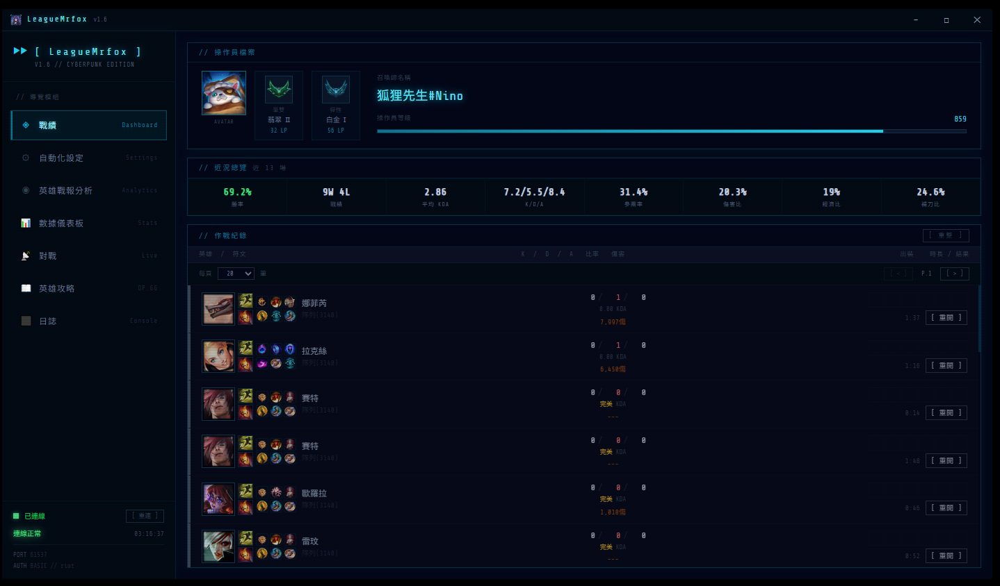
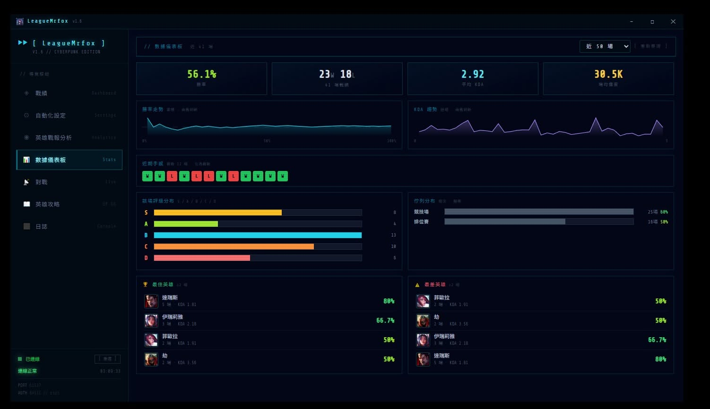
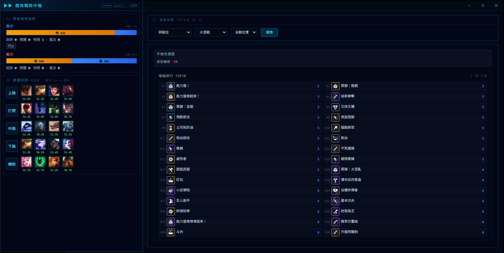

<p align="center">
  
</p>

<h1 align="center">LeagueMrfox</h1>

<p align="center">英雄聯盟 LCU 戰情終端 — Cyberpunk 風格桌面工具</p>

<p align="center">
  
  
  
  
  
</p>

---

## 1. 功能總覽

| 模組 | 說明 |
|------|------|
| **戰績** | 分頁瀏覽近 200 場戰紀錄，含 KDA、傷害、裝備、符文、時長；對局結束自動刷新 |
| **對戰** | 大廳 / 遊戲中自動掃描全場 10 人，顯示近 20 場勝率、KDA、即時段位 |
| **自動化** | 自動接受配對、自動選角、自動禁角（秒選 / 秒禁） |
| **英雄分析** | 統計個人拿手英雄與避雷英雄（≥ 3 場），含平均傷害 |
| **10 人雷達** | 雙欄呈現敵我雙方戰力，含單排 / 彈性段位透視；支援反匿名擊穿 |
| **拿手英雄 Top3** | 每位玩家顯示最常玩、勝率最高的 3 個英雄，知敵方拿手好 ban / 防 |
| **連勝 / 連敗** | 🔥 連勝 / ❄️ 連敗徽章，一眼看出對手手感 |
| **近期趨勢** | 近 5 場 W/L 走勢方塊，滑鼠移上顯示單場 KDA |
| **開黑偵測** | 以 `teamParticipantId` 標記敵我雙方組隊玩家（同組同色） |
| **數據儀表板** 🆕 | 視覺化個人戰報：勝率累積走勢、KDA 趨勢、S/A/B/C/D 評級分布、佇列勝率、最佳 / 最差英雄 |
| **選角戰術中樞** 🆕 | 即時解析雙方陣容：物理 / 魔法傷害比例、前排 / 開團數、職業分布，並提示缺口（缺前排 / 全物理…） |
| **常駐戰術浮窗** 🆕 | 選角階段自動彈出 always-on-top 小浮窗，全螢幕客戶端上也看得到戰術分析與 meta 建議禁用 |
| **OP.GG 攻略** | 整合 OP.GG 符文 / 出裝 / 召喚師技能 / 技能加點，選角時依英雄自動帶出 |
| **大混戰 (Kiwi)** 🆕 | 完整支援大混戰模式：增幅排行 TOP30（S→E tier 排序）、平衡調整數值整合、自動偵測模式 |
| **日誌 Console** | 獨立全螢幕分頁顯示系統日誌，支援文字選取複製 |

> 🆕 = V1.6 新增。本版重點為大混戰 (Kiwi) 模式完整支援；另含模式偵測修正與匿名玩家補名強化。

### 支援模式

| 模式 | 戰績掃描 | 攻略整合 |
|------|:--------:|:--------:|
| 一般對戰 / 積分對戰（召喚峽谷） | ✅ | ✅ 符文 / 出裝 / 加點 |
| 大亂鬥（ARAM） | ✅ | ✅ |
| 鬥魂競技（Arena） | ✅ | ✅ |
| 大混戰（Kiwi） | ✅ | ✅ 增幅排行 + 平衡調整 |

---

## 2. 使用方式

### 2.1 直接執行（推薦）

從 [Releases](../../releases/latest) 下載最新版 `LeagueMrfox.exe`，在**英雄聯盟客戶端開啟**的狀態下執行即可，無需安裝 Python。

### 2.2 從原始碼啟動

```bash
pip install eel requests psutil websockets urllib3 pywebview
python main.py
```

> 需要 Python 3.13，執行前請確認英雄聯盟客戶端正在運行。

---

## 3. 自行打包

1. 將 `app.ico` 放入專案根目錄與 `web/` 資料夾
2. 執行打包腳本：

```bash
pip install pyinstaller pywebview
build.bat
```

輸出：`dist\LeagueMrfox.exe`（單一執行檔，無黑視窗）

---

## 4. 系統需求

- Windows 10 / 11（內建 WebView2，無需額外安裝瀏覽器）
- 英雄聯盟客戶端（執行中）

---

## 5. 技術架構

- **後端**：Python 3.13 + [Eel](https://github.com/python-eel/Eel)
- **前端**：Vanilla JS + Tailwind CSS
- **視窗**：[pywebview](https://pywebview.flowrl.com/)（Windows WebView2，無邊框原生視窗 + 自訂標題列）
- **通訊**：LCU API（本機 HTTPS + WebSocket 事件監聽）
- **打包**：PyInstaller（`--onefile --noconsole`）

---

## 6. 隱私聲明

本工具僅在本機與英雄聯盟客戶端通訊，**不會上傳、儲存或傳送任何玩家個人資料**。

---

## 7. 程式展示

<p align="center">
  
</p>
<p align="center">
  
</p>
<p align="center">
  
</p>

---

## 8. 免責聲明

- 本工具僅供個人學習與研究使用
- 請勿用於違反 Riot Games 服務條款的行為
- LCU API 為非官方介面，Riot 可能隨時異動，使用風險自負
- ⚠️ 持續開發中，可能存在 Bug 及功能不完善之處，敬請見諒
